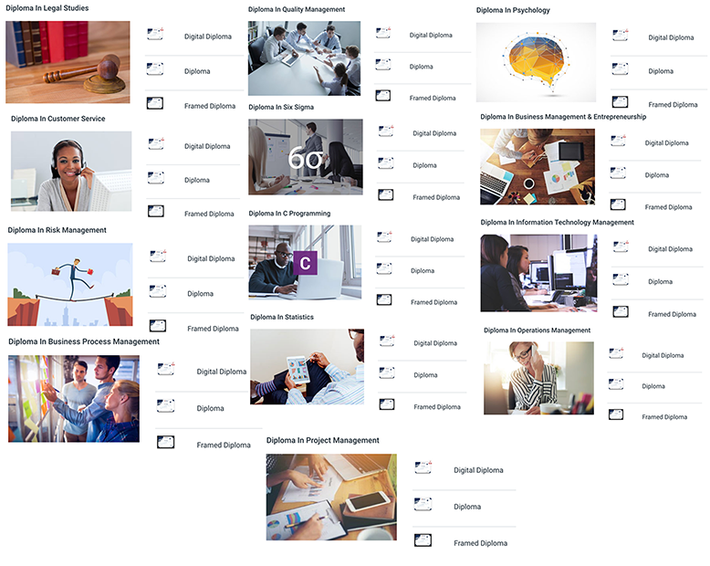

+++
title = "Educational Credentials"
subtitle = ""

date = 2016-04-20T00:00:00
lastmod = 2018-01-13T00:00:00
draft = false

# Authors. Comma separated list, e.g. `["Bob Smith", "David Jones"]`.
authors = []

tags = ["Education", "Blockchain", "Consulting", "Design Thinking", "Healthcare", "IoT", "Data Science", "Hadoop", "Big Data"]
summary = ""

# Projects (optional).
#   Associate this post with one or more of your projects.
#   Simply enter your project's folder or file name without extension.
#   E.g. `projects = ["deep-learning"]` references 
#   `content/project/deep-learning/index.md`.
#   Otherwise, set `projects = []`.
# projects = ["internal-project"]

# Featured image
# To use, add an image named `featured.jpg/png` to your project's folder. 
[image]
  # Caption (optional)
  # caption = ""

  # Focal point (optional)
  # Options: Smart, Center, TopLeft, Top, TopRight, Left, Right, BottomLeft, Bottom, BottomRight
  focal_point = ""

  # Show image only in page previews?
  preview_only = false

+++

## 2017 - 2018

**I. IBM IRELAND CERTIFICATION - [Verification Link](https://www.youracclaim.com/user/mohamed-sarfraz-ahmed)**

1. [Cognitive Practioner](https://www.youracclaim.com/badges/bfbe5628-e309-47fb-b2cf-d1f146bd7b84)
2. [IBM Analytics Services Strategic Enablement](https://www.youracclaim.com/badges/4dd1da80-ccae-4128-9b66-35cc5f8025dd)
3. [Healthcare Industry Foundations](https://www.youracclaim.com/badges/4e1ed83b-6187-43b5-a0f5-da5d634d6adf)
4. [Selling IoT](https://www.youracclaim.com/badges/43432b59-8b6f-4fec-8aa7-d0ede1cf3519)
5. [Hadoop Foundations](https://www.youracclaim.com/badges/b4b029dc-c3f3-4ba8-be8c-0c0c0a70a613)
6. [Big Data Foundations](https://www.youracclaim.com/badges/aebb12e5-2b6e-4c88-84a7-4c9b846839c2)
7. [IBM Blockchain Consulting](https://www.youracclaim.com/badges/0bac5ecf-bca8-4b8e-8d8d-ca3d5f624491)
8. [IBM Blockchain Essentials](https://www.youracclaim.com/badges/9e5ba2ff-5fd1-4560-b210-e342f88596fc)
9. [Data Science for Business](https://www.youracclaim.com/badges/3e29eafe-91c8-416a-8d20-06ddbc73d13c)
10. [IBM Agile Explorer](https://www.youracclaim.com/badges/69c36544-cf8e-498e-a015-eadfc98dda62) 
11. [Enterprise Design Thinking Practitioner](https://www.youracclaim.com/badges/32fc7819-b467-40ae-928b-2795ba9b9564)

**II. Cloud Analytics**

[Cloud Analytics Master](https://verify.skilljar.com/c/ke59whsu8u2f) - Cloud Analytics Academy 

## 2015

**[AlISON Online](https://alison.com/) - Diploma's**

1. Diploma Business Management & Entrepreneurship
2. Diploma Business Process Management
3. Diploma C Programming
4. Diploma Customer Service 
5. Diploma Information Technology Management 
6. Diploma Legal Studies 
7. Diploma Operations Management 
8. Diploma Project Management 
9. Diploma Psychology
10. Diploma Quality Management
11. Diploma Risk Management
12. Diploma Six Sigma
13. Diploma Statistics 

