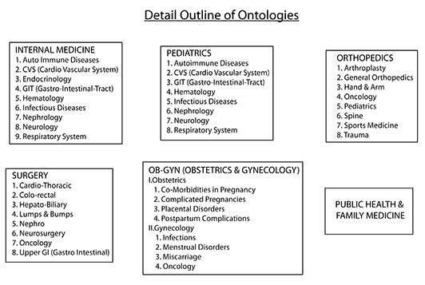
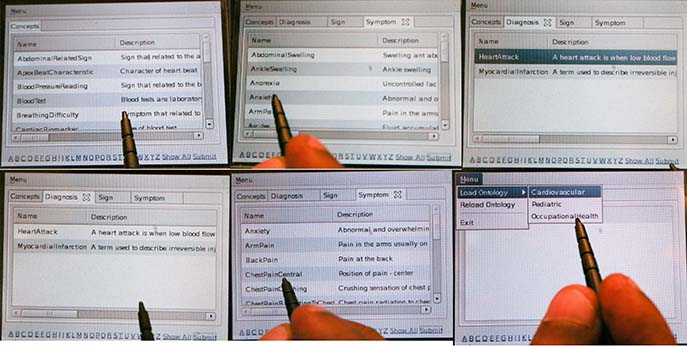
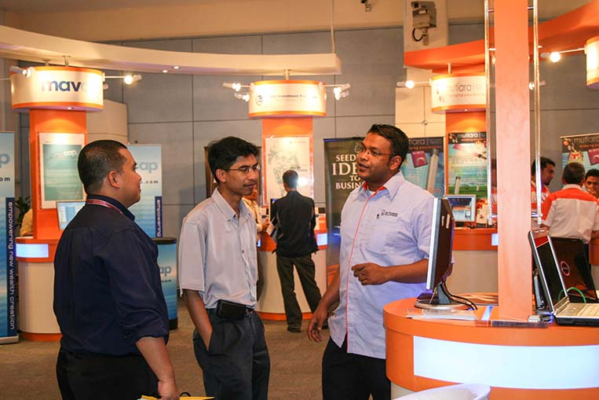

+++
# Project title.
title = "Ontologies & Semantic Web"

# Date this page was created.
date = 2011-01-01T00:00:00

# Project summary to display on homepage.
summary = "Ontologies in healthcare"

# Tags: can be used for filtering projects.
# Example: `tags = ["machine-learning", "deep-learning"]`
tags = ["Semantics", "Ontologies", "Healthcare", "Wearables", "Digital Diagnostics"]

# Optional external URL for project (replaces project detail page).
external_link = ""

# Slides (optional).
#   Associate this project with Markdown slides.
#   Simply enter your slide deck's filename without extension.
#   E.g. `slides = "example-slides"` references 
#   `content/slides/example-slides.md`.
#   Otherwise, set `slides = ""`.
slides = " "

# Links (optional).
url_pdf = ""
url_slides = ""
url_video = "o3.mp4"
url_code = ""

# Custom links (optional).
#   Uncomment line below to enable. For multiple links, use the form `[{...}, {...}, {...}]`.
# url_custom = [{icon_pack = "fab", icon="twitter", name="Follow", url = "https://twitter.com/georgecushen"}]

# Featured image
# To use, add an image named `featured.jpg/png` to your project's folder. 
#[image]
#  # Caption (optional)
#  caption = "Photo by rawpixel on Unsplash"
  
  # Focal point (optional)
  # Options: Smart, Center, TopLeft, Top, TopRight, Left, Right, BottomLeft, Bottom, BottomRight
  focal_point = "Smart"
+++

## Medical Informatics Platform

This project in which I as involved was for the development of Digital Diagnostic Algorithm that would be used for training junior physicians in the diagnosis of stat cases. I was the lead in the development of the ontological databases. The following were the scope of the disease domains for which, I had developed the ontologies. 

The following are the screen shots of the application which was developed. This was primarily for wearables using the palm os

Presentation of the product at an expo in Kuala Lumpur, Malaysia 

