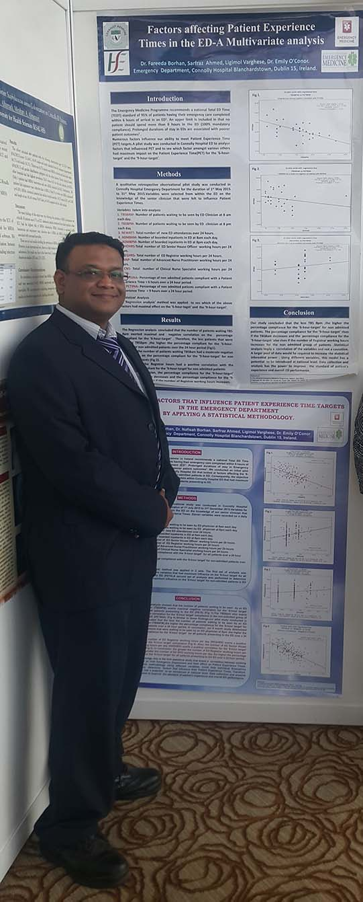

+++
title = "Identifying factors that influence the ‘6-hour target’ in the Emergency Department by applying regression analysis"
date = 2018-02-01T00:00:00
draft = false

# Authors. Comma separated list, e.g. `["Bob Smith", "David Jones"]`.
authors = ["MS Ahmed"]

# Publication type.
# Legend:
# 0 = Uncategorized
# 1 = Conference paper
# 2 = Journal article
# 3 = Manuscript
# 4 = Report
# 5 = Book
# 6 = Book section
publication_types = ["2"]

# Publication name and optional abbreviated version.
publication = ""
publication_short = ""

# Abstract and optional shortened version.
abstract = "The Emergency Medicine Programme in Ireland recommends a national Total ED Time (TEDT) standard of 95% of patients having their emergency care completed within 6 hours of arrival in an ED. Numerous factors influence our ability to meet Patient Experience Time (PET) targets. Consequent to our pilot study in May 20152, the aim of this study is to determine those factors within the ED that had maximum influence on the ‘6-hour target’ compliance for all patients presenting to the ED over a 24 hour period."
abstract_short = ""

# Is this a selected publication? (true/false)
selected = false

# Projects (optional).
#   Associate this publication with one or more of your projects.
#   Simply enter your project's folder or file name without extension.
#   E.g. `projects = ["deep-learning"]` references 
#   `content/project/deep-learning/index.md`.
#   Otherwise, set `projects = []`.
projects = []

# Slides (optional).
#   Associate this publication with Markdown slides.
#   Simply enter your slide deck's filename without extension.
#   E.g. `slides = "example-slides"` references 
#   `content/slides/example-slides.md`.
#   Otherwise, set `slides = ""`.
slides = ""

# Tags (optional).
#   Set `tags = []` for no tags, or use the form `tags = ["A Tag", "Another Tag"]` for one or more tags.
tags = ["Statistical Analysis", "Patience Experience Times", "Emergency Department"]

# Links (optional).
url_pdf = ""
url_preprint = ""
url_code = ""
url_dataset = ""
url_project = ""
url_slides = ""
url_video = ""
url_poster = ""
url_source = ""

# Custom links (optional).
#   Uncomment line below to enable. For multiple links, use the form `[{...}, {...}, {...}]`.
url_custom = [{name = "Irish Medical Journal", url = "http://imj.ie/identifying-factors-that-influence-the-6-hour-target-in-the-emergency-department-by-applying-regression-analysis/"}, {name = "PubMed", url = "https://www.ncbi.nlm.nih.gov/pubmed/?term=28657283"}, {name = "IAEM Ireland 2015", url = "http://www.thegreatvine.ie/iaem2015/#origianlresearch"}]
# Digital Object Identifier (DOI)
doi = ""

# Does this page contain LaTeX math? (true/false)
math = true

# Featured image
# To use, add an image named `featured.jpg/png` to your page's folder. 
[image]
  # Caption (optional)
  # caption = ""

  # Focal point (optional)
  # Options: Smart, Center, TopLeft, Top, TopRight, Left, Right, BottomLeft, Bottom, BottomRight
  focal_point = ""
+++

This project was also presented at **Emirates Society of Emergency Medicine** on 7 - 10 December 2016 in Scientific Conference 2016 Dubai, United Arab Emirates. 

